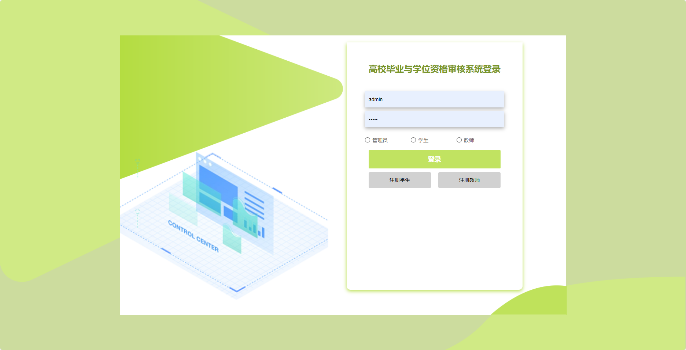
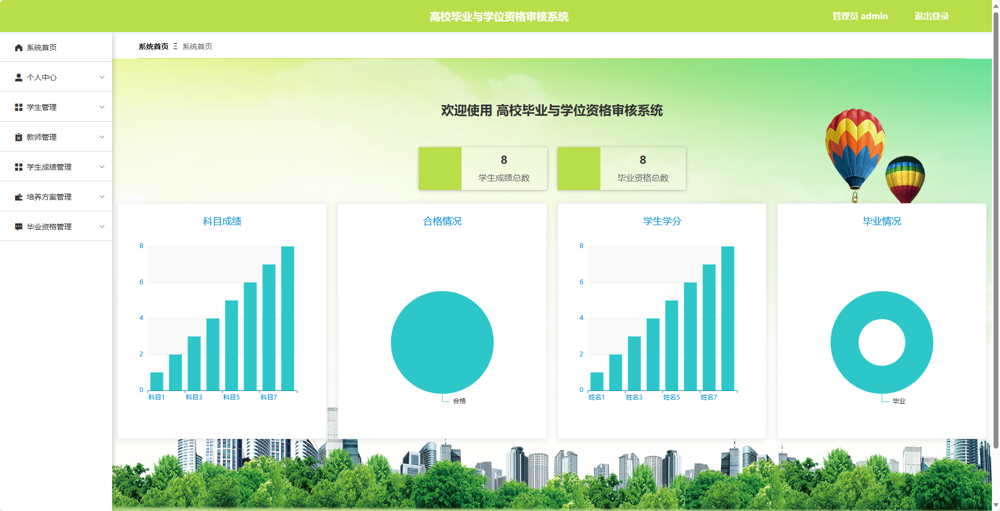
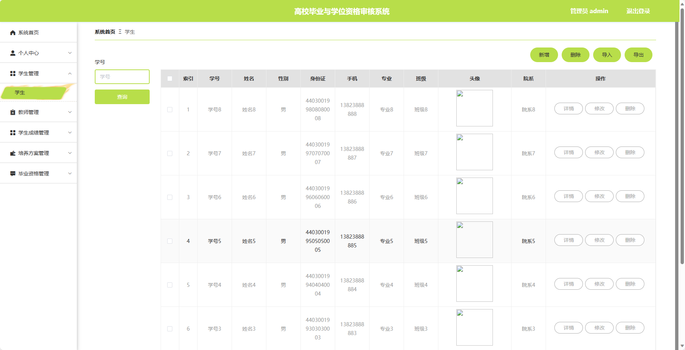
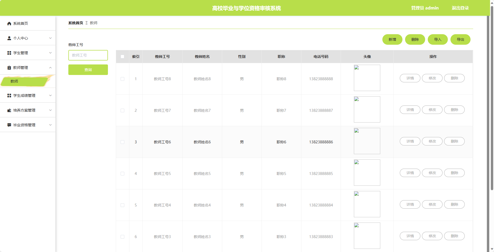
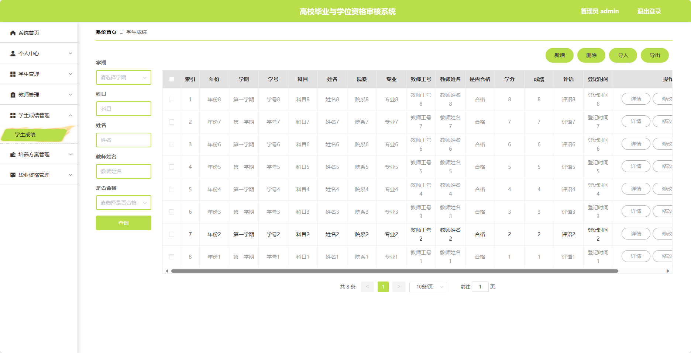
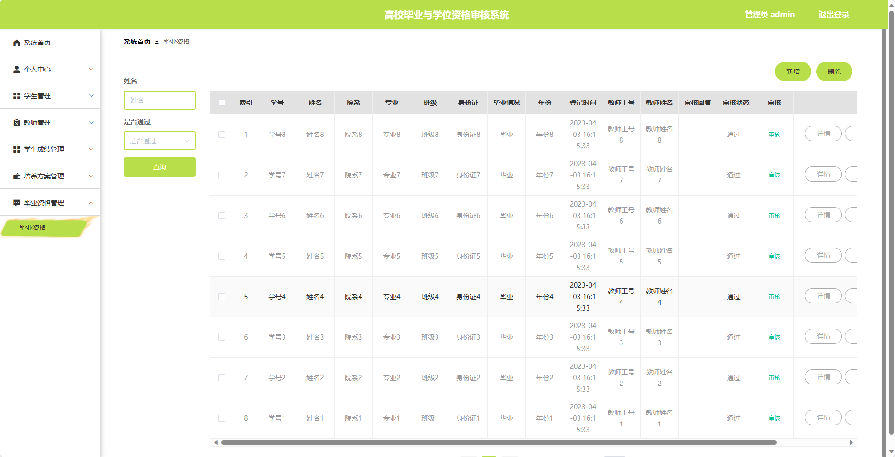
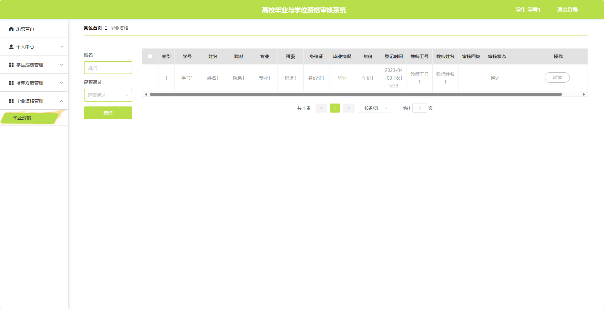
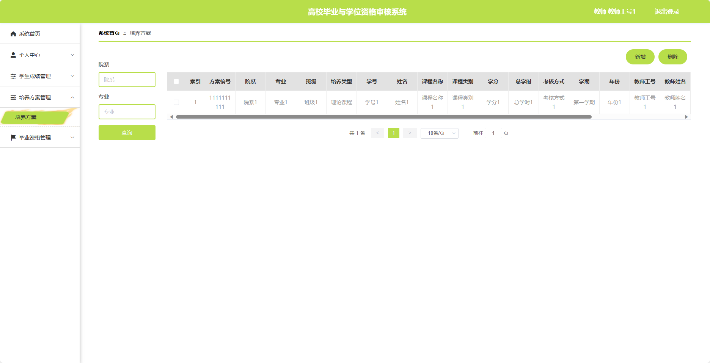
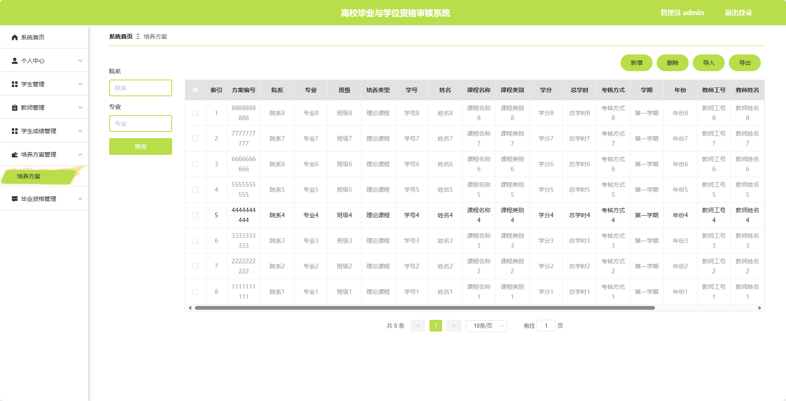

## 基于SpringBoot的高校毕业与学位资格审核系统

###  获取sql数据库文件: 从戎源码网 (https://armycodes.com/) QQ: 386869957 QQ群: 377586148
###  所有系统地址: (https://github.com/YuLin-Coder/AllProjectCatalog) 
###  所有项目以及源代码本人均调试运行无问题 可支持远程安装部署调试、定制修改、代码讲解

## 项目介绍
基于SpringBoot的高校毕业与学位资格审核系统，系统包含三种角色：管理员、学生、教师，主要功能如下。

### 【管理员】:
1. 个人中心：管理员可以管理个人信息，包括修改密码、查看个人资料等。
2. 学生管理：管理员可以管理学生的基本信息，包括添加、编辑、删除学生信息等操作。
3. 教师管理：管理员可以管理教师的基本信息，包括添加、编辑、删除教师信息等操作。
4. 学生成绩管理：管理员可以管理学生的学习成绩，包括录入、修改、查询学生成绩等操作。
5. 培养方案管理：管理员可以管理学生的培养方案，包括制定、编辑、删除培养方案等操作。
6. 毕业资格管理：管理员可以审核学生的毕业资格。

### 【学生】:
1. 个人中心：学生可以管理个人信息，包括修改密码、查看个人资料等。
2. 学生成绩管理：学生可以查看自己的学习成绩，包括查询已修课程成绩、计算绩点等操作。
3. 培养方案管理：学生可以查看自己的培养方案，了解所需修读的课程、学分等信息。
4. 毕业资格管理：学生可以提交毕业资格申请材料，包括学分记录、实习报告等，进行审核操作。

### 【教师】:
1. 个人中心：教师可以管理个人信息，包括修改密码、查看个人资料等。
2. 学生成绩管理：教师可以录入和修改学生的学习成绩，对学生的学业情况进行管理。
3. 培养方案管理：教师可以制定和编辑学生的培养方案，包括设置课程要求、学分要求等。
4. 毕业资格管理：教师可以审核学生的毕业资格，包括学分要求、课程完成情况、实习报告等审核操作。

## 项目技术
- 编程语言：Java
- 数据库：MySQL
- 项目管理工具：Maven
- 前端技术：HTML、CSS、JavaScript、Jquery、Vue
- 后端技术：Spring、SpringMVC、MyBatis

## 运行环境
- JDK版本：JDK1.8及以上
- 开发工具：IDEA、Ecplise、Myecplise都可以
- 数据库: MySQL5.7及以上
- Maven：maven3.0及以上
- Node：14.14.0及以上

## 运行截图

